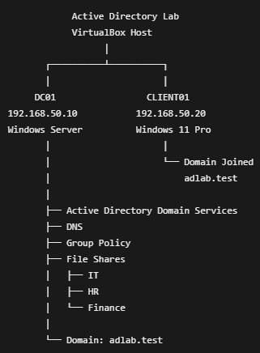
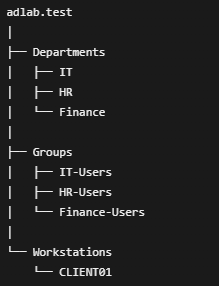
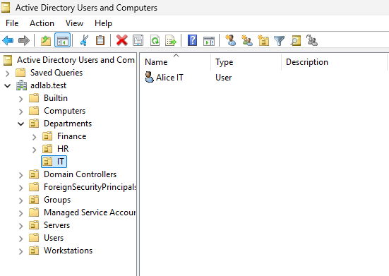
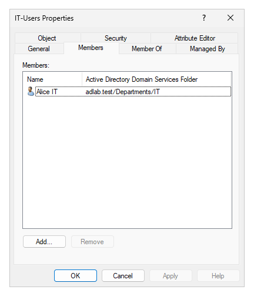
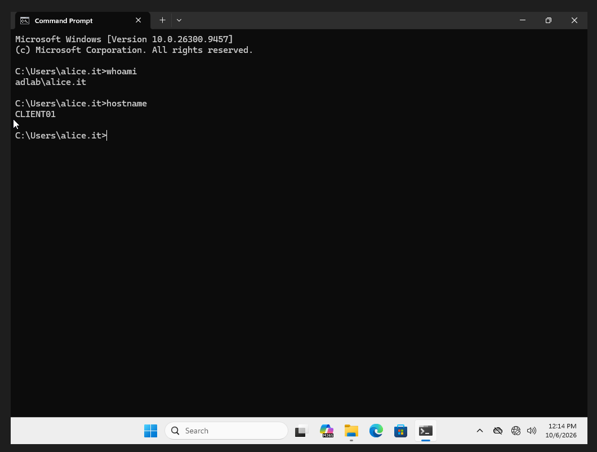
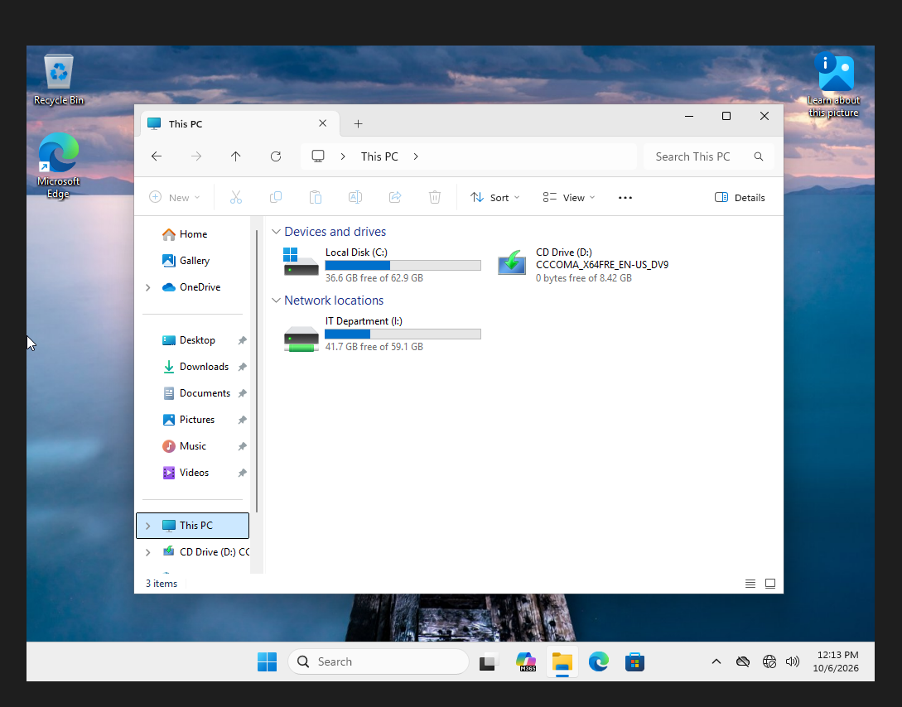
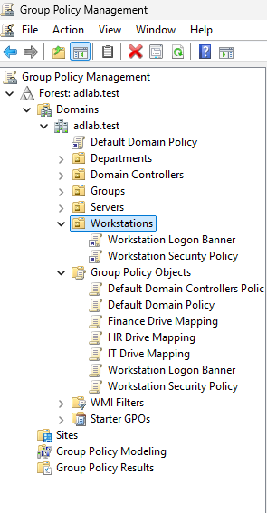
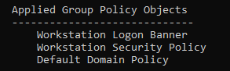
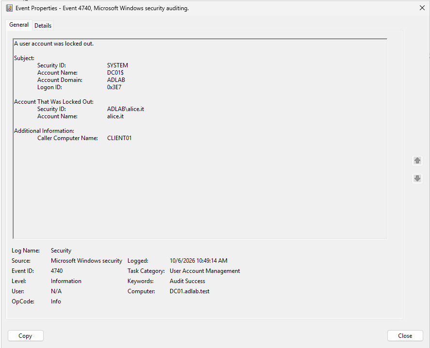

# Active Directory Help Desk Lab

## Overview

This project is a virtualized Windows Active Directory lab built to practice common enterprise IT and Help Desk administration tasks.

The environment was created using Oracle VirtualBox and consists of a Windows Server domain controller and a Windows 11 Pro client workstation joined to an Active Directory domain.

The lab focuses on practical skills including user and group administration, Group Policy, DNS, file permissions, mapped network drives, account lockouts, password resets, and Windows authentication troubleshooting.

---

## Lab Environment

**Domain:** `adlab.test`

**Network:** `192.168.50.0/24`

### DC01

- Windows Server
- IP Address: `192.168.50.10`
- Active Directory Domain Services
- DNS
- Group Policy
- Department file shares

### CLIENT01

- Windows 11 Pro
- IP Address: `192.168.50.20`
- Joined to `adlab.test`
- Used to test domain authentication, permissions, and Group Policy

---

## Lab Architecture

### Active Directory Structure

The domain was organized into several Organizational Units and security groups.

### Departments

- IT
- HR
- Finance

### Security Groups

- IT-Users
- HR-Users
- Finance-Users

### Workstations

- CLIENT01

---

## Active Directory Administration

I created and managed domain users for multiple departments and organized them using Active Directory Organizational Units.

Tasks performed included:

- Creating user accounts
- Creating Organizational Units
- Creating security groups
- Adding users to department security groups
- Enabling and disabling accounts
- Resetting passwords
- Unlocking locked accounts
- Managing workstation computer objects

---

## Security Groups and Access Control

Department access was managed using Active Directory security groups rather than assigning permissions directly to individual users.

Example:

`alice.it` → `IT-Users` → IT resource permissions

This provided practice with group-based access control and basic role-based access concepts.

---

## Domain-Joined Windows Workstation

CLIENT01 was configured as a Windows 11 Pro workstation and joined to the `adlab.test` Active Directory domain.

Domain users were then able to authenticate to the workstation using Active Directory credentials.

This provided hands-on practice with:

- Domain joins
- Domain authentication
- Computer accounts
- DNS requirements for Active Directory
- Windows user profiles

---

## DNS and Networking

DC01 was configured with a static IPv4 address:

`192.168.50.10`

CLIENT01 was configured as:

`192.168.50.20`

Both systems use the subnet:

`255.255.255.0`

CLIENT01 uses DC01 as its DNS server so that Active Directory resources such as `adlab.test` and `dc01.adlab.test` can be resolved correctly.

DNS connectivity was tested using tools such as:

- `ping`
- `ipconfig`
- `nslookup`

---

## Department File Shares

Department network shares were created for:

- IT
- HR
- Finance

Examples:

`\\DC01\IT`

`\\DC01\HR`

`\\DC01\Finance`

Both share permissions and NTFS permissions were configured using department security groups.

For example, members of `IT-Users` could access the IT share while users from HR or Finance were denied access.

---

## Automatic Drive Mapping with Group Policy

Group Policy Preferences were used to automatically map department network drives.

Examples:

- IT → `I:`
- HR → `H:`
- Finance → `F:`

Users automatically received the correct mapped drive after signing into CLIENT01.

---

## Group Policy

Several Group Policy Objects were created and linked to appropriate Organizational Units.

Policies included:

- Workstation logon banner
- Department drive mappings
- Workstation inactivity lock
- Account lockout policy

Group Policy application was verified using:

`gpupdate /force`

and:

`gpresult /scope computer /r`

---

## Account Lockout and Password Troubleshooting

A domain account lockout policy was configured to lock accounts after repeated invalid login attempts.

The lab was used to simulate a common Help Desk scenario:

1. User repeatedly enters an incorrect password.
2. Active Directory locks the account.
3. Administrator verifies the user's account status.
4. Administrator unlocks the account.
5. User successfully signs in again.

This provided hands-on experience with common Active Directory account-support workflows.

---

## Event Viewer Troubleshooting

Windows Event Viewer was used to investigate authentication activity on the domain controller.

Relevant Windows Security events included:

- Event ID `4625` — Failed logon
- Event ID `4740` — User account locked out

This demonstrated how Windows logs can be used to troubleshoot authentication and account-access issues.

---

## Troubleshooting Performed

Several issues occurred while building the environment and were diagnosed and resolved, including:

- User accounts being disabled
- Forgotten user passwords
- Domain account lockouts
- Security-group membership not immediately applying to logged-in sessions
- Missing department drive mappings
- Incorrect workstation computer naming
- Group Policy troubleshooting
- Domain administrator versus local administrator permissions
- DNS resolution verification
- Share and NTFS permission issues
- Verifying applied Group Policy with `gpresult`

These troubleshooting scenarios provided practical experience similar to common Tier 1 / Tier 2 Help Desk tasks.

---

## Skills Demonstrated

- Active Directory Domain Services
- Windows Server administration
- Windows 11 administration
- User and group management
- Organizational Units
- Active Directory security groups
- Password resets
- Account unlocking
- Group Policy
- DNS
- IPv4 networking
- Domain joins
- NTFS permissions
- SMB/network shares
- Mapped network drives
- Windows Event Viewer
- Authentication troubleshooting
- `ipconfig`
- `ping`
- `nslookup`
- `gpupdate`
- `gpresult`
- Oracle VirtualBox

---

## Purpose

This lab was created as a hands-on environment for developing practical Windows enterprise administration and Help Desk troubleshooting skills.

Future versions may expand the environment with additional Windows clients, security monitoring, centralized logging, and cybersecurity-focused tooling.
